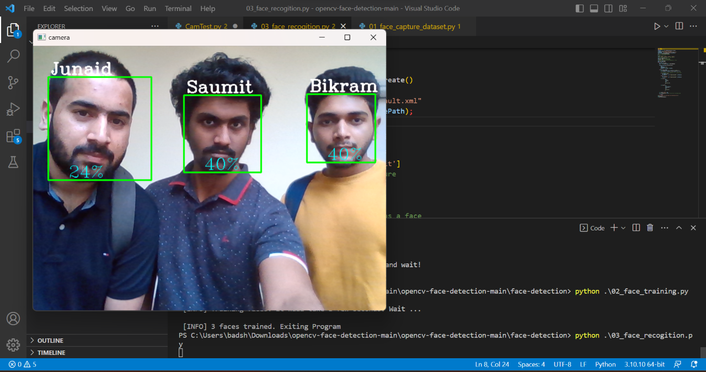
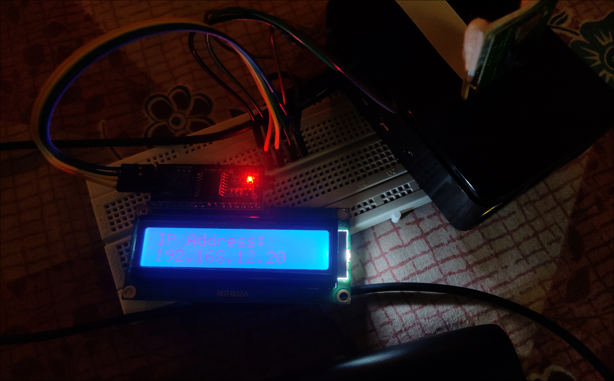
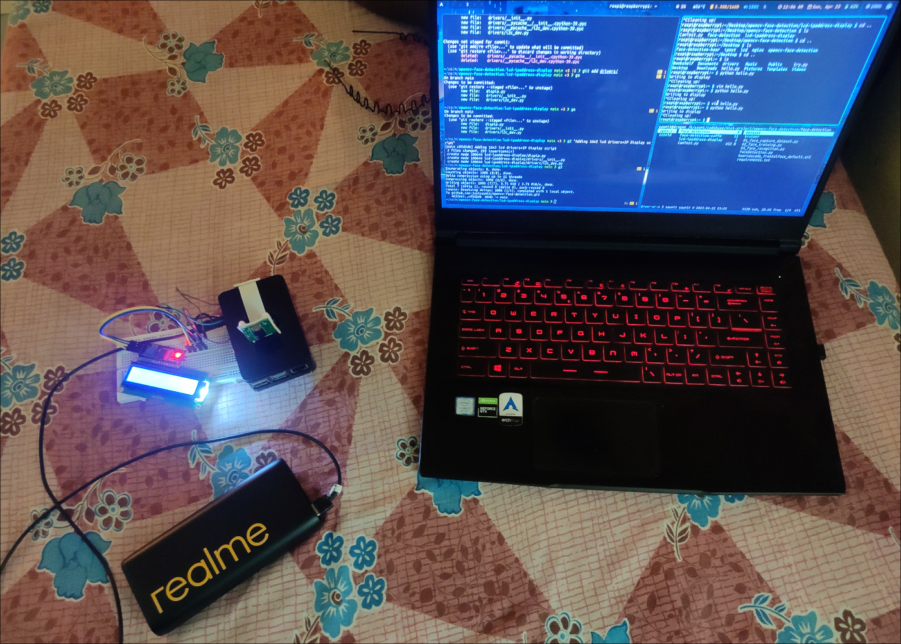

# Face Detection using OpenCV with Raspberry Pi

## Introduction

This project aims to develop a **portable** and **wireless** Face Recognition System (FRS) using Raspberry Pi with a Camera Module attachment. The Raspberry Pi is powered using a power-bank, enabling the development of a portable facial recognition system.   
The project makes use of the **OpenCV** (Open-source Computer Vision) library, an open-source library for computer vision and machine learning tasks with contributions from more than a thousand developers.  
We chose to use cascade classifier method specifically Haar cascade object detection for facial detection over TensorFlow due to less complexity, moderate performance, lower system requirements, and better integration.

## Architecture


The Raspberry Pi acts as a wireless access point (WAP), connecting to it would allow developers and users to interact with their devices. Upon connecting with the network, it would be able to provide services such as SSH server, VNC server, and a Webserver. To access the system, developers can access the Raspberry Pi using the terminal using SSH, and VNC allows the system to be controlled remotely from a mobile device or a desktop computer. For the user side, they can view the live feed or access the database by logging in to a WebUI, which would lead them to an Authentication portal. This functionality provides cybersecurity by taking Security and Privacy Measures, ensuring that user data is protected and stored securely, and access is restricted to authorized personnel only.

## Flow

1. **Hardware Setup**: Connect a Raspberry Pi camera module to the Raspberry Pi board. We have a portable Face Detection System consisting of Raspberry Pi 4B with a Camera Module. It is also connected to a Powerbank for power.

2. **Software Setup**: Install Required Libraries: Install the OpenCV library on the Raspberry Pi using the terminal command "pip install opencv-python".

3. **Networking Setup**: Enable Wireless Access Point configuration (IEEE 802.11) and run the services SSH on port 22, VNC on port 5900, and WebUI at port 5000.

4. **Face Detection**: Load the Haar Cascade Classifier haarcascade_frontalface_default.xml file using the cv2.CascadeClassifier() function.

5. **Capture the Image**: Use OpenCV to capture the image from the Raspberry Pi camera module using the cv2.VideoCapture() function.

6. **Preprocess the Image**: Convert the captured image to grayscale using the cv2.cvtColor() function to improve the efficiency of the face detection algorithm.

7. **Detect Faces**: Use the detectMultiScale() function of the cascade classifier to detect faces in the grayscale image. It returns the coordinates of the bounding boxes.

8. **Display the Detected Faces**: Draw a rectangle around each detected face using the coordinates obtained and display the image using the cv2.imshow() function.

9. **View Detected Faces**: The displayed detected faces can be viewed by VNC or WebUI using a live feed. Upon reaching the WebUI, users will be confronted with an Authentication portal allowing them to log in as either “admin” or “viewer” for Database management, and live-feed is accessible to all.

10. **Release Resources**: Release the video capture and destroy all windows using the cv2.release() and cv2.destroyAllWindows() functions, respectively.

## Progression



Initial trial- Using HaarCascade classifier for face detection and using LBPH(Local Binary Patterns Histograms) recognizer for training the model.



Using LCD 1602 I2C Screen to get the Local IP Address of the Raspberry Pi.


Overall Setup

# Steps to follow post-installation

## 1. Update mirrors
Original repo does not hit so I changed the mirror
``` bash
sudo nano /etc/apt/sources.list
```
and replace "http://raspbian.raspberrypi.org/raspbian/" with any working mirror from [here](https://www.raspbian.org/RaspbianMirrors).

## 2. Update & Upgrade Packages

``` bash
sudo apt update && sudo apt upgrade
```

## 3. Enable VNC and LCD 16x2 Screeen

### Enable I2C Interface and VNC
To enable the I2C interface on Raspberry Pi, you can use the following steps:

1. Open the terminal on Raspberry Pi.
2. Run the command 
``` yaml
sudo raspi-config.
```
3. Select "Interfacing Options".
4. Select "VNC".
5. Select "Yes" to enable VNC.
6. Select "I2C".
7. Select "Yes" to enable the interface.
8. Reboot the Raspberry Pi.


## Wireless Adapter

Command for checking whether driver for **Bus 001 Device 003: ID 2357:010c TP-Link TL-WN722N v2/v3 [Realtek RTL8188EUS]** wireless adapter is installed or not

```yaml
lsmod | grep 8188eu
```

## Installing OpenCV on Raspberry Pi
We initially tried installing opencv package using pip on our device and it worked, however doing the same on Raspberry Pi didn't work out because there were no pre-built binaries and in order to compile the wheel it would take alot of time and then give errors.   
We tried to resolve the errors and then waited alot more time for it to end compiling however we would face the same error regharding the wheel.
So we tried another approach reading a Raspberry Pi forum, to use the 64bit Raspberry Pi OS than using the 32-bit variant.
Which also eliminated the step of updating mirror.

